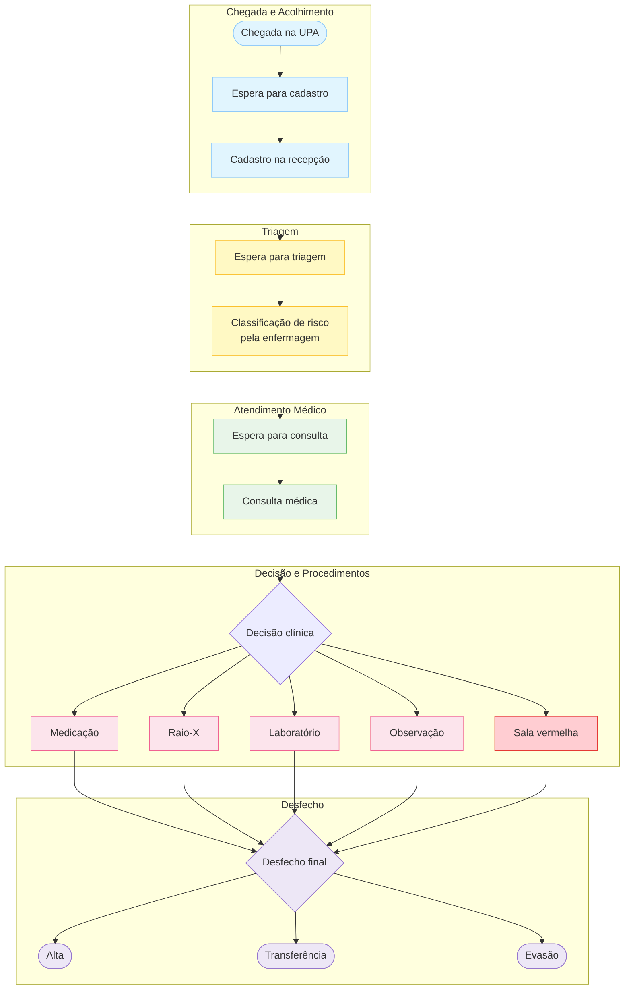

# Jornada do Paciente na UPA

## Chegada e Acolhimento
- Chegada na unidade
- Espera para cadastro
- Cadastro na recepção
## Classificação de Risco
- Espera para triagem
- Classificação de risco pela enfermagem (triagem)
## Atendimento Médico
- Espera para consulta médica
- Consulta médica
## Procedimentos Complementares
- Exames laboratoriais
- Exames de imagem
- Medicação
- Observação
- Indicação de transferência
- Encaminhamento para sala vermelha
## Desfecho
- Alta
- Evasão
- Transferência

---
## Análise dos tempos de espera em cada etapa
- [Arquivo base ](https://docs.google.com/spreadsheets/d/1ADjBKwcxvYHsuQTn9ePB81kiWBPV_5tQsQwW8uW1mUE/edit?usp=sharing)

A análise de 15 pacientes atendidos revela que o principal gargalo do fluxo está relacionado aos **exames laboratoriais**, que quando necessários (**27% dos casos**), elevam o tempo de permanência de aproximadamente **58 minutos para mais de 3 horas** — um aumento de **300% no tempo total**.

